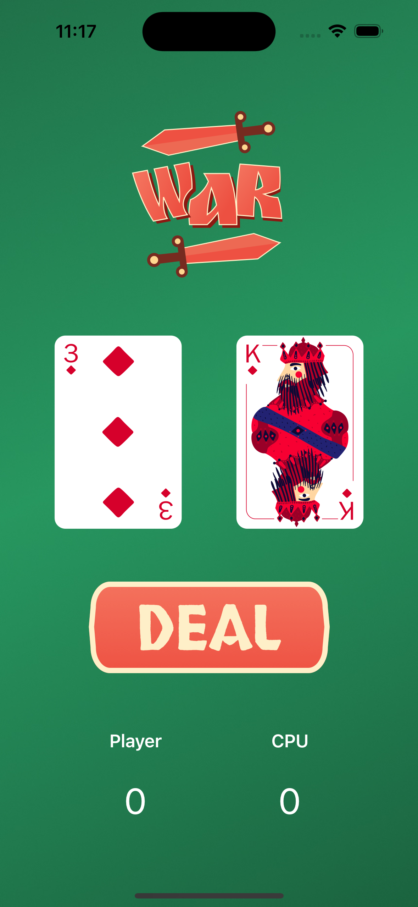
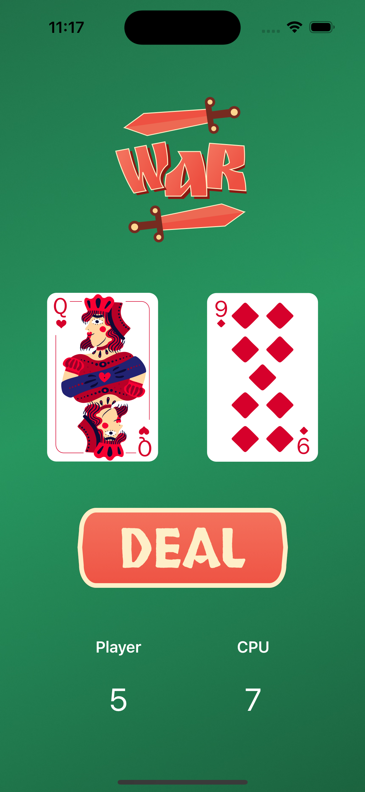

## Swift Coding Course - War Card Game App

    This repo contains the code I wrote while following along with lessons 4-8 of the Swift coding course by CodeWithChris on YouTube.

Course overview

    This course teaches the basics of building iOS apps using Swift and Xcode. Lessons 4-8 focuses on:

    Functions and Buttons

    HStack, ZStack, VStack
    
    Modifier Positioning
    
    UI Design -> Logic Building
    
About lessons 4-8

    In these lessons we build a version of the War Card Game with Swift, integrating functions and buttons.

To run the lessons 4-8 app code:

    Clone this repo
    Open the Xcode project file
    Build and run the app in a simulator or physical device

Let me know if you have any other questions!
